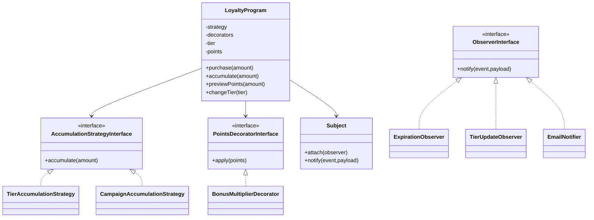

# 📘 Programa de Fidelidade — João Pedro Pires Ferretti

Sistema completo de **Programa de Fidelidade**, com pontuação dinâmica por tier, acúmulo em campanhas, expiração automática de pontos, mudança automática de nível e suporte para web + CLI.

Este projeto implementa **3 padrões obrigatórios**:
✔ Strategy
✔ Decorator
✔ Observer

E ainda utiliza **Factory Method** e **Singleton** como complementos ao design.

---

# 📑 Sumário

1. Problema
2. Solução
3. Padrões de Projeto Implementados

   * Strategy
   * Decorator
   * Observer
   * Factory Method (extra)
   * Singleton (extra)
4. Diagrama Geral (mermaid)
5. Estrutura de Pastas
6. Como instalar
7. Como rodar o projeto (Web + CLI)
8. Como rodar testes
9. Decisões de Design
10. Limitações e próximos passos
11. Créditos

---

# 1. 🎯 Problema

Empresas que operam programas de fidelidade precisam:

* calcular pontos baseados no **tier do cliente** (bronze, gold, platinum),
* aplicar **bônus temporários**,
* expirar pontos automaticamente,
* atualizar tier quando atingem novos limites,
* notificar sistemas ou usuários sobre eventos,
* permitir acúmulo em contextos especiais (campanhas Black Friday, etc.).

Essas regras mudam frequentemente e exigem um sistema **flexível, modular e extensível**, ideal para padrões de projeto.

---

# 2. 🧩 Solução

O projeto implementa um **motor de fidelidade completo**, capaz de:

* acúmulo de pontos por tier;
* acúmulo em campanhas com multiplicadores;
* bônus adicionais via decorators;
* expiração automática de pontos;
* mudança de tier automática e antecipada;
* notificações via observers;
* interface web (index.php);
* interface CLI (app/cli.php).

Tudo organizado em camadas e modelos orientados a objetos.

---

# 3. 🏗 Padrões de Projeto Implementados

## ✔ Strategy (obrigatório)

Usado para definir **como pontos são acumulados** ou resgatados.

### Onde é aplicado:

`strategies/AccumulationStrategyInterface.php`
`strategies/TierAccumulationStrategy.php`
`strategies/CampaignAccumulationStrategy.php`
`domain/LoyaltyProgram.php`

### Por quê?

A regra de cálculo de pontos muda conforme:

* o tier,
* campanhas especiais,
* bônus futuros.

Strategy permite **trocar a regra em runtime**, sem alterar o LoyaltyProgram.

---

## ✔ Decorator (obrigatório)

Usado para aplicar **bônus temporários empilháveis**.

### Onde é aplicado:

`decorators/BonusMultiplierDecorator.php`

### Por quê?

Campanhas como “+50% pontos hoje” não deveriam estar na Strategy para não quebrar o princípio de responsabilidade única.

Decorator permite aplicar **quantos bônus quiser simultaneamente**, sem alterar Strategy.

---

## ✔ Observer (obrigatório)

Usado para eventos do sistema:

* Expiração automática de pontos
* Mudança automática de tier
* Notificações por e-mail (CLI)
* Registro de histórico (web)

### Onde é aplicado:

`observers/Subject.php`
`observers/ExpirationObserver.php`
`observers/TierUpdateObserver.php`
`observers/EmailNotifier.php`

* SessionObserver dentro do web

### Por quê?

Eventos ocorrem **independentemente** da regra de acúmulo:
expiração, upgrades de tier, logs, alertas.

Observer permite adicionar novos comportamentos sem tocar no núcleo.

---

## ✔ Factory Method (extra)

Usado para criar estratégias dinamicamente.

### Onde:

`factory/StrategyFactory.php`

Evita vários `switch` espalhados pelo código.

---

## ✔ Singleton (extra)

Usado para configuração única:

### Onde:

`infra/Config.php`

Garantindo uma única instância para configurações globais.

---

# 4. 📊 Diagrama Geral (Mermaid)



---

# 5. 📁 Estrutura de Pastas

```
domain/            → núcleo do negócio
strategies/        → estratégias de acúmulo e resgate
decorators/        → bônus empilháveis
observers/         → eventos automáticos
factory/           → criação modular de estratégias
infra/             → Config (Singleton)
app/               → CLI funcional
public/            → interface web (index.php)
tests/             → testes PHPUnit
```

---

# 6. ⚙️ Como instalar

Requisitos:

* PHP 8.1+
* Composer

Instalar dependências:

```
composer install
```

---

# 7. ▶️ Como rodar o projeto

## 🔵 Interface Web (recomendada para testes visuais)

```
php -S localhost:8000 -t public
```

Abra em:
👉 [http://localhost:8000](http://localhost:8000)

Inclui:

* histórico de eventos
* bônus decorator
* reset de pontos
* tier dinâmico funcionando

---

## 🟢 Interface CLI

```
php app/cli.php
```

Mostra:

* acúmulo por diferentes estratégias
* decorators
* expiração automática
* mudança de tier
* notificações (EmailNotifier)

---

# 8. 🧪 Como rodar testes

```
vendor/bin/phpunit --testdox
```

Resultado esperado:

✔ Bonus multiplier applies
✔ Observers are notified
✔ Strategy swap changes points
✔ Expiration observer
✔ Redeem strategy
✔ Singleton works

---

# 9. 🧠 Decisões de Design

* **Tier é atualizado ANTES da compra** (cálculo antecipado evita “compra atrasada”).
* **StrategyFactory** evita `switch` e mantém flexibilidade.
* **TierRules centraliza limites**, deixando código limpo.
* **Observer substitui toda lógica automática** → expiração, upgrades, notificações.
* **Decorator** só altera o cálculo final, não altera Strategy.
* **Histórico na Web é limpo e amigável**, graças ao payload filtrado.

---

10. ⚠️ Limitações e próximos passos

Ainda não há persistência em banco → apenas sessão/CLI.

Pontos poderiam expirar por data real, não por “evento simulado”.

Faltam mais campanhas e regras de tier.

Poderia existir API REST.

# 11. 👤 Créditos

**Desenvolvido por:**
📌 **João Pedro Pires Ferretti**
para a disciplina de **Linguagem de Programação e Paradigmas**